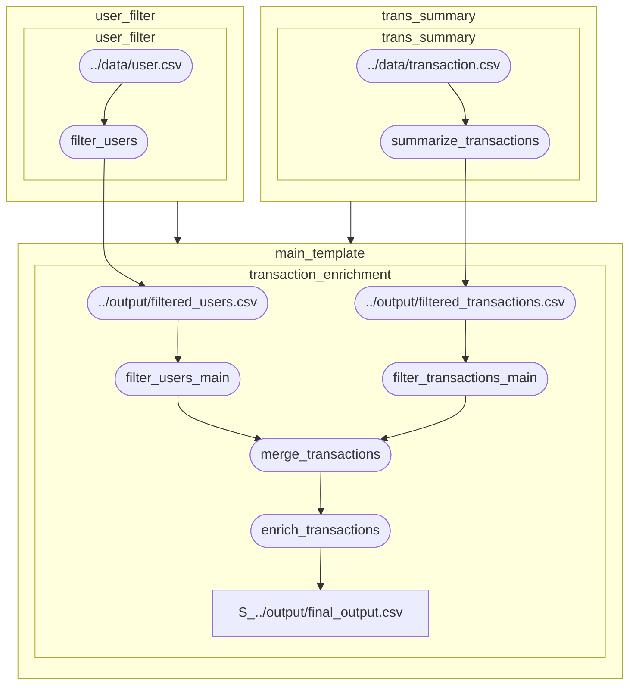

# ROTab

**A template that moves with your thinking.**  
**Fully compatible with LLM-based generation and validation.**

**ROTab** is a lightweight tool that defines data processing using YAML templates and automatically converts them into executable Python code.  
No implementation code required—just describe what you want to do.  
This is the minimal system designed to realize that philosophy.

---

## Use Cases

- When you want to record data processing as a reproducible, reusable structure
- When you need to share and review processing logic with non-engineers
- When you want LLMs to generate, modify, or validate processing templates
- When you need to rapidly prototype and test different processing pipelines
- When you want to visualize the entire pandas-compliant workflow as a clear structure

## What ROTab Offers

- Intuitive, readable syntax for describing processing logic—even for non-engineers
- No scripting or boilerplate code—just write a YAML template
- Auto-generates standalone, executable Python code
- Automatically visualizes the pipeline as a DAG
- Easily extendable using your own function files

---

## 1. How to Use

### Template Example (YAML)

```yaml
depends:
  - user_filter.yaml
  - trans_summary.yaml

processes:
  - name: transaction_enrichment
    description: Enrich user data with transaction details
    tables:
      - name: user
        path: ../../output/filtered_users.csv
      - name: trans
        path: ../../output/filtered_transactions.csv
    steps:
      - name: filter_users_main
        with: user
        filter: age > ${params.min_age}
        new_columns: |
          log_age = log(age)
          age_bucket = age // 10 * 10
        columns: [user_id, log_age, age_bucket]
      - name: filter_transactions_main
        with: trans
        filter: amount > 1000
      - name: merge_transactions
        dataframes: enriched = merge(left=user, right=trans, on='user_id')
      - name: enrich_transactions
        with: enriched
        new_columns: high_value = amount > 10000
        columns: ${params.enrich_transactions.columns}
    dumps:
      - return: enriched
        path: ../../output/final_output.csv
```

### Paramete Injection

You can inject values from a parameter YAML file using the ${...} syntax inside your templates.
The parameter file must be explicitly specified via param_path when loading templates.

For example:

```yaml
filter: age > ${params.min_age}
```

The value will be replaced by the corresponding entry in your parameter file, such as:

```yaml
# params.yaml
params:
  min_age: 18
```

This allows dynamic and reusable templates by separating logic from configuration.

### Running the Pipeline

```python
from rotab.core.pipeline import Pipeline

pipeline = Pipeline.from_template_dir(
        dirpath="./examples/config/templates",
        param_path="./examples/config/params/params.yaml",
        new_columns_func_paths=["./custom_functions/new_columns_funcs.py"],
        dataframes_func_paths=["./custom_functions/dataframes_funcs.py"],
    )
pipeline.run(script_path="./scripts/generated_user_flow.py", execute=True, dag=True)
```

- Python code is generated at the path specified in the template
- The generated code is standalone and directly executable

---

## 2. Generated Python Code

```python
import pandas as pd
from rotab.core.operation.define_funcs import *
from rotab.core.operation.transform_funcs import *
import importlib.util
import os
spec = importlib.util.spec_from_file_location('define_funcs', r'/home/yutaitatsu/rotab/custom_functions/define_funcs.py')
define_funcs = importlib.util.module_from_spec(spec)
spec.loader.exec_module(define_funcs)
globals().update({k: v for k, v in define_funcs.__dict__.items() if callable(v) and not k.startswith('__')})
spec = importlib.util.spec_from_file_location('transform_funcs', r'/home/yutaitatsu/rotab/custom_functions/transform_funcs.py')
transform_funcs = importlib.util.module_from_spec(spec)
spec.loader.exec_module(transform_funcs)
globals().update({k: v for k, v in transform_funcs.__dict__.items() if callable(v) and not k.startswith('__')})


# STEPS FUNCTIONS:

def step_filter_users_transaction_enrichment(user):
    """Step: filter_users """
    user = user.query('age > 18').copy()
    user.loc[:, 'log_age'] = user.apply(lambda row: log(row['age']), axis=1)
    user.loc[:, 'age_bucket'] = user.apply(lambda row: row['age'] // 10 * 10, axis=1)
    user = user[['user_id', 'log_age', 'age_bucket']]
    return user

def step_filter_transactions_transaction_enrichment(trans):
    """Step: filter_transactions """
    trans = trans.query('amount > 1000').copy()
    return trans

def step_merge_transactions_transaction_enrichment(merge, trans, user):
    """Step: merge_transactions"""
    return merge(left=user, right=trans, on='user_id')

def step_enrich_transactions_transaction_enrichment(enriched):
    """Step: enrich_transactions """
    enriched.loc[:, 'high_value'] = enriched.apply(lambda row: row['amount'] > 10000, axis=1)
    enriched = enriched[['user_id', 'log_age', 'amount', 'high_value']]
    return enriched

# PROCESSES FUNCTIONS:

def process_transaction_enrichment():
    """Enrich user data with transaction details"""
    # load tables
    user = pd.read_csv(r'/home/rotab/examples/data/user.csv')
    trans = pd.read_csv(r'/home/rotab/examples/data/transaction.csv')

    # process steps
    user = step_filter_users_transaction_enrichment(user)
    trans = step_filter_transactions_transaction_enrichment(trans)
    enriched = step_merge_transactions_transaction_enrichment(merge, trans, user)
    enriched = step_enrich_transactions_transaction_enrichment(enriched)

    # dump output
    path = os.path.abspath(r'../output/final_output.csv')
    os.makedirs(os.path.dirname(path), exist_ok=True)
    enriched.to_csv(path, index=False)


if __name__ == '__main__':
    process_transaction_enrichment()
```

---

## 3. Automatic DAG Generation

The template is internally analyzed for dependencies and automatically converted into a DAG.



---

## 4. Built-in Functions

### Column Definition (`define`)

| Function                      | Description                        |
| ----------------------------- | ---------------------------------- |
| `log(x, base=10)`             | Logarithm with custom base         |
| `log1p(x)`                    | Natural logarithm of (1 + x)       |
| `exp(x)`                      | Exponential function               |
| `sqrt(x)`                     | Square root                        |
| `clip(x, min, max)`           | Clamp value between min and max    |
| `round(x, n=0)`               | Round to n decimal places          |
| `floor(x)`                    | Round down to nearest integer      |
| `ceil(x)`                     | Round up to nearest integer        |
| `abs(x)`                      | Absolute value                     |
| `len(x)`                      | Length of a string or list         |
| `startswith(x, p)`            | Check if string starts with prefix |
| `endswith(x, s)`              | Check if string ends with suffix   |
| `lower(x)`                    | Convert string to lowercase        |
| `upper(x)`                    | Convert string to uppercase        |
| `replace_values(x, old, new)` | Replace substring                  |
| `strip(x)`                    | Trim whitespace                    |
| `format_datetime(x, format)`  | Format datetime string             |
| `year(x)`                     | Extract year from datetime         |
| `month(x)`                    | Extract month                      |
| `day(x)`                      | Extract day                        |
| `weekday(x)`                  | Extract weekday (0 = Monday)       |
| `hour(x)`                     | Extract hour                       |
| `days_between(x1, x2)`        | Number of days between two dates   |
| `is_null(x)`                  | Check for null or NaN              |
| `not_null(x)`                 | Check for non-null value           |
| `min(x1, x2)`                 | Minimum of two values              |
| `max(x1, x2)`                 | Maximum of two values              |

### Table Transformation (`transform`)

| Function                                                     | Description                                       |
| ------------------------------------------------------------ | ------------------------------------------------- |
| `sort_by(table, column, ascending=True)`                     | Sort table by a column                            |
| `groupby_agg(table, by, aggregations)`                       | Group and aggregate. Example: `{"amount": "sum"}` |
| `drop_duplicates(table, subset=None)`                        | Remove duplicate rows                             |
| `merge(left, right, on, how='inner')`                        | Merge two dataframes on a column                  |
| `reshape(table, column_to, columns_from, column_value, agg)` | Pivot/melt depending on parameters                |
| `fillna(table, mapping)`                                     | Fill missing values. Example: `{"age": 0}`        |
| `sample(table, frac)`                                        | Random sample by fraction                         |
| `concat(tables)`                                             | Concatenate tables vertically                     |
| `drop_na(table, subset=None)`                                | Drop rows with missing values                     |
| `replace(table, columns, old, new)`                          | Replace values in specified columns               |

---

## License

MIT License

Copyright (c) 2025 PROJECT RO
